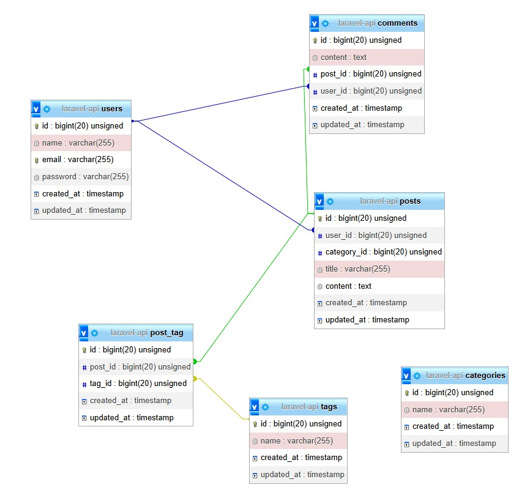

<p align="center">
  <a href="https://laravel.com" target="_blank">
    
  </a>
</p>

# Laravel JWT API
Este proyecto es una API RESTful construida con Laravel que permite a los usuarios registrarse, iniciar sesión, crear publicaciones, comentar, y asociar etiquetas (tags) a los posts. Utiliza autenticación con JWT y relaciones entre múltiples tablas.


## 🛠 Tecnologías

- PHP 8+
- Laravel 10+
- MySQL
- Composer
- JWT Auth (tymon/jwt-auth)
- Postman (para pruebas)

---
---
## 🚀 Instalación

1. Clonar el repositorio:
   ```bash
   git clone https://github.com/GonzaloNegro/laravel-api-Blogs-posts-jwt
   cd laravel-api-Blogs-posts-jwt

2. Instalar dependencias:
    ```bash
    composer install

3. Copiar el archivo .env de ejemplo:
    ```bash
    cp .env.example .env

4. Generar la clave de la aplicación:
    ```bash
    php artisan key:generate

5. Configurar la base de datos en el archivo .env.
    ```bash
    DB_DATABASE=nombre_de_tu_bd
    DB_USERNAME=usuario
    DB_PASSWORD=contraseña
    
6. Ejecutar las migraciones:
    ```bash
    php artisan migrate

7. Instalar el paquete JWT:
    ```bash
   php artisan jwt:secret

9. Levantar el servidor de desarrollo:
    ```bash
    php artisan serve

---

🔐 Autenticación con JWT
La API utiliza JWT (JSON Web Tokens) para autenticar usuarios.
Las rutas protegidas requieren que se incluya el token en el encabezado:
Authorization: Bearer {token}

---

🧪 Endpoints (Postman)
La colección de Postman incluye:

POST /api/register → Registro

POST /api/login → Login

GET /api/posts → Listar posts

POST /api/posts → Crear post (autenticado)

PUT /api/posts/{id} → Actualizar post

DELETE /api/posts/{id} → Eliminar post

POST /api/comments → Comentar en un post

POST /api/tags → Crear tag

PUT /api/posts/{id} con "tags": [1, 2] → Asociar tags a un post

📁 Importá la colección desde /postman/collection.json.

📘 Consultá todos los endpoints y ejemplos en la colección Postman:
📄 docs/API de Blog.postman_collection.json

---

🔐 Autenticación
Este proyecto usa JWT. Para acceder a rutas protegidas:

Iniciar sesión con POST /api/login

Copiar el token del response

En Postman, ir a Authorization → Bearer Token y pegar el token

🧩 Relaciones
Un User tiene muchos Posts y Comments

Un Post pertenece a un User, tiene una Category, muchos Comments y muchos Tags

Un Tag puede estar en muchos Posts

---

## 🧩 Documentación Adicional

📌 **Relación entre tablas:**  
Esta imagen muestra cómo se relacionan las tablas del sistema:  


---

 🧪 Tecnologías utilizadas
PHP 8+

Laravel 10

MySQL / PostgreSQL

JWT con tymon/jwt-auth

Postman

---
Un User tiene muchos Posts y Comments

Un Post pertenece a un User, tiene una Category, muchos Comments y muchos Tags

Un Tag puede estar en muchos Posts

---

✍️ Autor
Desarrollado por Gonzalo Negro
📍 Córdoba, Argentina
